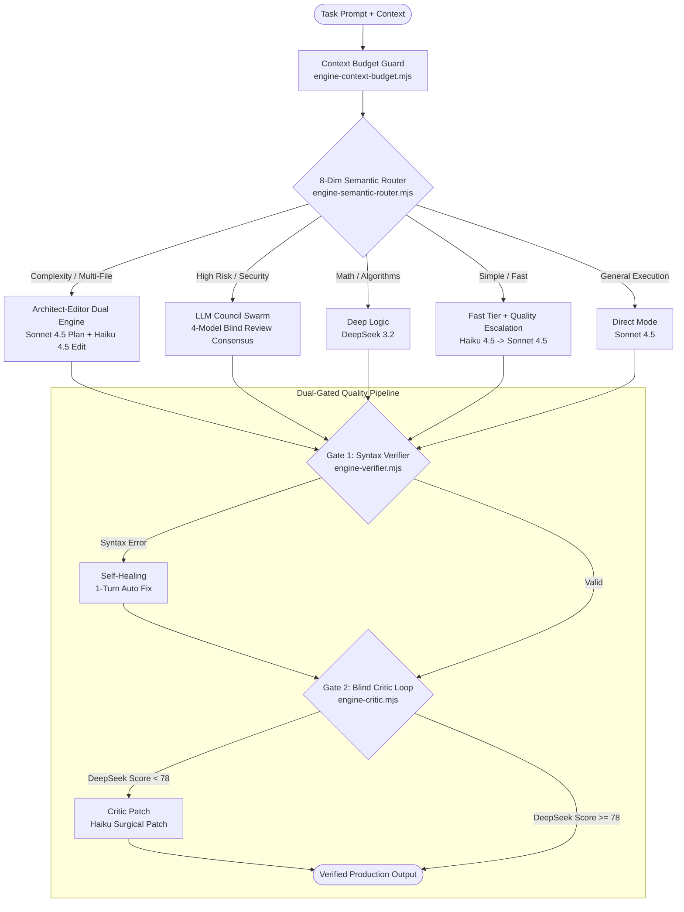

# ⚡ Kiro Agent V2.1 - Autonomous Multi-Model Swarm Engine & Dual-Gated Verification

> **Production-Grade Multi-Model AI Swarm, Architect-Editor Dual Engine, 8-Dimensional Semantic Router, Dual-Gated Quality Verification, and 20-Account Autonomous Compute Subsystem for Google Antigravity IDE and Kiro Proxy.**

[](https://opensource.org/licenses/MIT)
[](https://nodejs.org/)
[-blue.svg)](https://modelcontextprotocol.io/)
[](#cross-platform-support)
[-brightgreen.svg)](https://github.com/WillyEverGreen/Antigravity-Auto-Submitter)

---

## 🌟 Overview & What's New in V2.1

The **Kiro Agent Subsystem** transforms your local Kiro IDE Proxy into a production-grade, distributed multi-model swarm with autonomous quality control:

1. **8-Dimensional Semantic Router (`engine-semantic-router.mjs`)**:
   Replaces naive keyword heuristics with multi-vector signal scoring (*complexity, risk, speed, reasoning, consensus, refactor, debug, docs*). Automatically routes tasks to the optimal model and execution topology (`architect-editor`, `council`, `logic`, `fast`, or `direct`).

2. **Dual-Gated Quality Verification Pipeline**:
   - **Gate 1: AST Syntax Verifier & Self-Healing (`engine-verifier.mjs`)**: Inspects bracket balance, JS/TS, ESM (`import`/`export`), and JSON structure before delivery. Executes a 1-turn automated correction loop if syntax errors are detected.
   - **Gate 2: Blind Peer-Review Critic Loop (`engine-critic.mjs`)**: **DeepSeek 3.2** independently audits candidate outputs across 4 quality vectors (*correctness, robustness, efficiency, cleanliness*). If the composite score is below 78, **Claude Haiku 4.5** applies a surgical patch before output reaches the user.

3. **Context Budget Manager (`engine-context-budget.mjs`)**:
   Employs 3.8 chars/token estimation and multi-tier trimming (`truncate-context-first`, `truncate-prompt-middle`, `equal-cut`) with sliding-window chunking, preventing context overflow cliffs and V8 OOM crashes.

4. **Adaptive Quality Retry & Escalation (`engine-quality-retry.mjs`)**:
   Evaluates 5 dimensions (*completeness, concreteness, correctness, length, structure*). If fast-tier output degrades, it auto-escalates along the model ladder: `Claude Haiku 4.5` $\to$ `Claude Sonnet 4.5` $\to$ `DeepSeek 3.2`.

5. **Architect-Editor Dual Engine (`engine-architect-editor.mjs`)**:
   Dispatches high-level planning to **Claude Sonnet 4.5** and rapid code generation to **Claude Haiku 4.5**, dropping complex execution times from **106s $\to$ ~13s (7.7x faster)**.

6. **5-Layer Anti-Ban Armor (`kiro-controller.mjs`)**:
   Protects your 20 accounts using hardware fingerprint isolation (64-hex Machine IDs), staggered OIDC token refreshes, circuit breaker backoffs, and quota cliff failovers.

7. **Native Model Context Protocol (MCP) Server (`kiro-mcp.mjs`)**:
   Exposes 14 native MCP tools directly into Google Antigravity IDE, including `kiro_smart_route`.

---

## 🏗️ Architecture



---

## ⚖️ Swarm Architecture vs Single-Model (Opus Alone)

| Dimension | Single Model (Opus Alone) | Our Swarm Architecture (V2.1) |
| :--- | :--- | :--- |
| **Cognitive Diversity** | Single perspective; repeats its own blind spots and hallucinations. | **Multi-Model Consensus**: Sonnet plans, Haiku edits, DeepSeek audits. |
| **Peer Review** | Cannot blindly audit itself without confirmation bias. | **Blind Peer Review**: DeepSeek 3.2 scores outputs with zero self-bias. |
| **Speed & Latency** | High latency on every task regardless of simplicity. | **Tiered Dispatch**: ~9s on simple queries via Fast Tier; heavy orchestration only when needed. |
| **Error Recovery** | Fails silently on syntax defects unless reprompted manually. | **Autonomous Self-Healing**: Gate 1 syntax repair + Gate 2 critic patching. |
| **Context Safety** | Vulnerable to context blowout on huge codebases. | **Context Budget Guard**: Pre-flight token budgeting and sliding-window chunking. |
| **Account Protection** | Manual token management. | **5-Layer Anti-Ban Armor**: 64-hex Machine IDs, circuit breakers, and quota cliff failover. |

---

## 🚀 CLI Commands & MCP Tools

### 1. Task Execution & Swarms

| Action | CLI Command | MCP Tool | Description |
| :--- | :--- | :--- | :--- |
| **Autonomous Route** | `kiro route "<prompt>" [options]` | `kiro_smart_route` | 🧭 8-Dim Semantic Router + Dual-Gated Verification |
| **Architect-Editor** | `kiro arch "<prompt>"` | `kiro_architect_editor` | ⚡ High-speed dual engine (~13-18s) |
| **LLM Council** | `kiro council "<prompt>"` | `kiro_council` | 🏛️ 4-Model blind peer review consensus |
| **Model Swarm** | `kiro swarm "<prompt>"` | `kiro_swarm` | Consensus swarm synthesis |
| **Single Task** | `kiro run "<prompt>" [-m <model>]` | `kiro_run` | Run single model with role persona (supports `-m auto`) |
| **Parallel Batch** | `kiro parallel -f tasks.json` | `kiro_parallel_tasks` | Concurrently dispatches across 20-account pool |
| **Code Review** | `kiro review <file>` | `kiro_code_review` | Multi-dimensional adversarial review |
| **Proxy Health** | `kiro status` | `kiro_status` | View 20-account pool health & token metrics |
| **List Models** | `kiro models` | `kiro_list_models` | List all available models & context limits |
| **Live Benchmark** | `kiro benchmark` | — | Run head-to-head latency benchmark |

#### CLI Routing Options:
```bash
# Full autonomous dispatch (auto mode, auto verify, auto critic)
kiro route "Implement thread-safe priority queue in TypeScript"

# Force topology mode: auto | arch | council | logic | fast | direct
kiro route "Security audit this token parser" --mode council

# Customize critic quality threshold (default: 82)
kiro route "Draft quick test cases" --threshold 75

# Fast execution bypassing critic or verifier gates
kiro route "Explain quicksort" --no-critic
```

---

### 2. Semantic Cache & Long-Term Memory (Mem0 Pattern)

| Action | CLI Command | Description |
| :--- | :--- | :--- |
| **Cache Stats** | `kiro cache stats` | View semantic cache hits, tokens saved, and backend status |
| **Clear Cache** | `kiro cache clear` | Flush all cached responses |
| **List Memories** | `kiro memory list [category]` | View persistent user preferences, invariants & decisions |
| **Add Memory** | `kiro memory add <category> "<text>"` | Save a permanent preference or architectural invariant |
| **Search Memories** | `kiro memory search "<query>"` | Semantic vector search across all memories in <1ms |
| **Delete Memory** | `kiro memory delete <id>` | Remove a memory entry |

---

### 3. Account & Security Management

| Action | CLI Command | Description |
| :--- | :--- | :--- |
| **List Accounts** | `kiro accounts` | View all 20 accounts, status, IdP & active status |
| **Anti-Ban Shield** | `kiro armor` | Verify 5-layer anti-ban protection status |
| **Switch Account** | `kiro accounts switch <email>` | Set local active account |
| **Refresh Token** | `kiro token refresh <email>` | Directly renew OIDC / Social token |
| **Machine IDs** | `kiro machine-id [show\|gen\|set]` | Inspect or assign 64-hex hardware fingerprints |
| **Proxy Pool** | `kiro pool [list\|add\|rm]` | Configure proxy endpoints and rotation |
| **Webhooks** | `kiro webhook [list\|add\|test]` | Telegram, Discord, DingTalk, Feishu alerts |

---

## 🛡️ 5-Layer Anti-Ban Armor

| Security Layer | Threat Prevented | How It Protects |
| :--- | :--- | :--- |
| **Hardware Fingerprint Isolation** | Multi-account correlation on 1 PC | Generates a unique 64-hex Machine ID for each of the 20 accounts. |
| **Token Refresh Rate Limiter** | AWS OIDC token flood bans | Caps token refresh concurrency to 3, staggered across 15m intervals. |
| **Circuit Breaker Exponential Backoff** | Rapid 429/403 loop suspensions | Automatically suspends faulty accounts (60s base backoff) and fails over. |
| **Quota Cliff Protection** | Account lock on 100% exhaustion | Switches accounts automatically when remaining quota drops below 5%. |
| **Token Reserve Margin** | Context overflow cliff | Enforces a 25,000 token safety buffer on all requests. |

